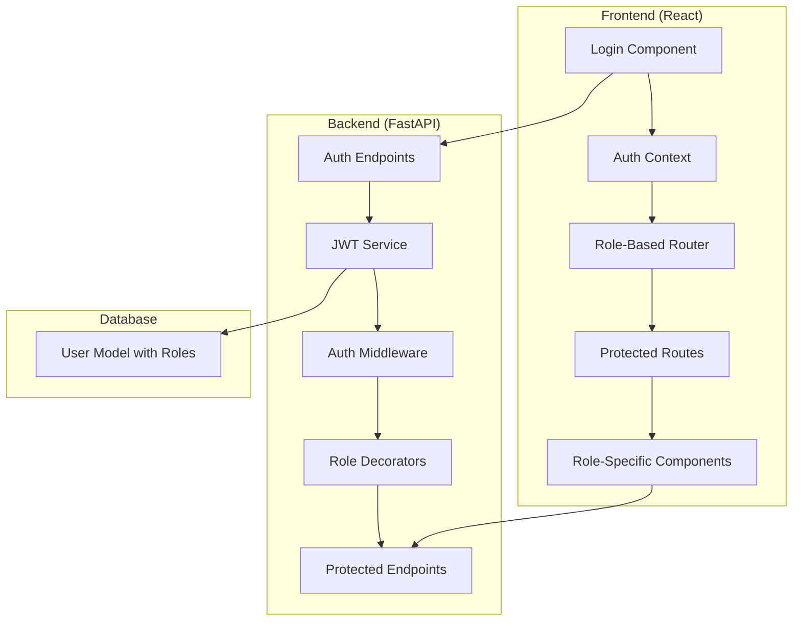

# Design Document

## Overview

This design document outlines the implementation of Role-Based Access Control (RBAC) for the Classroom + RAG Web App. The system will be implemented in phases, starting with core authentication and role validation, then expanding to comprehensive permission management. The design focuses on security, maintainability, and user experience while building upon the existing FastAPI backend and React frontend architecture.

## Architecture

### High-Level Architecture



### Phase 1: Core Role-Based Authentication

The initial implementation focuses on establishing secure role-based login and basic access control.

## Components and Interfaces

### Backend Components

#### 1. Enhanced User Model
```python
class User(Base):
    __tablename__ = "users"
    
    id = Column(Integer, primary_key=True, index=True)
    username = Column(String, unique=True, index=True, nullable=False)
    email = Column(String, unique=True, index=True, nullable=False)
    hashed_password = Column(String, nullable=False)
    full_name = Column(String)
    role = Column(String, default="student")  # student, professor, admin
    is_active = Column(Boolean, default=True)
    created_at = Column(DateTime(timezone=True), server_default=func.now())
    updated_at = Column(DateTime(timezone=True), onupdate=func.now())
```

#### 2. JWT Service with Role Support
```python
class JWTService:
    def create_access_token(self, data: dict, expires_delta: Optional[timedelta] = None):
        # Include role in JWT payload
        to_encode = data.copy()
        if expires_delta:
            expire = datetime.utcnow() + expires_delta
        else:
            expire = datetime.utcnow() + timedelta(minutes=ACCESS_TOKEN_EXPIRE_MINUTES)
        to_encode.update({"exp": expire})
        encoded_jwt = jwt.encode(to_encode, SECRET_KEY, algorithm=ALGORITHM)
        return encoded_jwt
    
    def verify_token(self, token: str):
        # Extract and validate role from token
        payload = jwt.decode(token, SECRET_KEY, algorithms=[ALGORITHM])
        return payload
```

#### 3. Authentication Middleware
```python
async def get_current_user(token: str = Depends(oauth2_scheme), db: Session = Depends(get_db)):
    credentials_exception = HTTPException(
        status_code=status.HTTP_401_UNAUTHORIZED,
        detail="Could not validate credentials",
        headers={"WWW-Authenticate": "Bearer"},
    )
    try:
        payload = jwt.decode(token, SECRET_KEY, algorithms=[ALGORITHM])
        username: str = payload.get("sub")
        role: str = payload.get("role")
        if username is None:
            raise credentials_exception
        token_data = TokenData(username=username, role=role)
    except JWTError:
        raise credentials_exception
    
    user = get_user(db, username=token_data.username)
    if user is None:
        raise credentials_exception
    return user
```

#### 4. Role-Based Authorization Decorators
```python
def require_role(allowed_roles: List[str]):
    def decorator(func):
        @wraps(func)
        async def wrapper(*args, **kwargs):
            current_user = kwargs.get('current_user')
            if not current_user or current_user.role not in allowed_roles:
                raise HTTPException(
                    status_code=status.HTTP_403_FORBIDDEN,
                    detail="Insufficient permissions"
                )
            return await func(*args, **kwargs)
        return wrapper
    return decorator

# Usage examples:
@require_role(["professor", "admin"])
async def mark_attendance(...)

@require_role(["admin"])
async def manage_users(...)
```

### Frontend Components

#### 1. Enhanced Authentication Context
```javascript
const AuthContext = createContext();

export const AuthProvider = ({ children }) => {
  const [user, setUser] = useState(null);
  const [loading, setLoading] = useState(true);

  const login = async (credentials, role) => {
    const response = await authService.login({ ...credentials, role });
    const { access_token, user_info } = response;
    
    localStorage.setItem('token', access_token);
    localStorage.setItem('user', JSON.stringify(user_info));
    setUser(user_info);
    
    return response;
  };

  const hasRole = (requiredRole) => {
    return user?.role === requiredRole || 
           (Array.isArray(requiredRole) && requiredRole.includes(user?.role));
  };

  const hasPermission = (permission) => {
    const rolePermissions = {
      student: ['view_dashboard', 'view_timetable', 'view_attendance'],
      professor: ['view_dashboard', 'view_timetable', 'view_attendance', 'mark_attendance', 'cancel_class'],
      admin: ['*'] // All permissions
    };
    
    return rolePermissions[user?.role]?.includes(permission) || 
           rolePermissions[user?.role]?.includes('*');
  };

  return (
    <AuthContext.Provider value={{ user, login, logout, hasRole, hasPermission, loading }}>
      {children}
    </AuthContext.Provider>
  );
};
```

#### 2. Role-Based Router Component
```javascript
const RoleBasedRouter = () => {
  const { user, loading } = useAuth();

  if (loading) return <LoadingSpinner />;
  if (!user) return <Navigate to="/login" />;

  const getDashboardRoute = () => {
    switch (user.role) {
      case 'student':
        return '/student/dashboard';
      case 'professor':
        return '/professor/dashboard';
      case 'admin':
        return '/admin/dashboard';
      default:
        return '/dashboard';
    }
  };

  return (
    <Routes>
      <Route path="/" element={<Navigate to={getDashboardRoute()} />} />
      <Route path="/student/*" element={
        <ProtectedRoute requiredRole="student">
          <StudentRoutes />
        </ProtectedRoute>
      } />
      <Route path="/professor/*" element={
        <ProtectedRoute requiredRole="professor">
          <ProfessorRoutes />
        </ProtectedRoute>
      } />
      <Route path="/admin/*" element={
        <ProtectedRoute requiredRole="admin">
          <AdminRoutes />
        </ProtectedRoute>
      } />
    </Routes>
  );
};
```

#### 3. Protected Route Component
```javascript
const ProtectedRoute = ({ children, requiredRole, requiredPermission }) => {
  const { user, hasRole, hasPermission } = useAuth();

  if (!user) {
    return <Navigate to="/login" />;
  }

  if (requiredRole && !hasRole(requiredRole)) {
    return <AccessDenied message="You don't have permission to access this page." />;
  }

  if (requiredPermission && !hasPermission(requiredPermission)) {
    return <AccessDenied message="You don't have permission to perform this action." />;
  }

  return children;
};
```

#### 4. Role-Aware Login Component
```javascript
const Login = () => {
  const [selectedRole, setSelectedRole] = useState('student');
  const [credentials, setCredentials] = useState({ username: '', password: '' });
  const { login } = useAuth();
  const navigate = useNavigate();

  const handleSubmit = async (e) => {
    e.preventDefault();
    try {
      await login(credentials, selectedRole);
      // Navigation handled by RoleBasedRouter
    } catch (error) {
      setError('Invalid credentials or insufficient permissions');
    }
  };

  return (
    <div className="login-container">
      <form onSubmit={handleSubmit}>
        <div className="role-selector">
          <label>Login as:</label>
          <div className="role-options">
            <button 
              type="button"
              className={selectedRole === 'student' ? 'active' : ''}
              onClick={() => setSelectedRole('student')}
            >
              Student
            </button>
            <button 
              type="button"
              className={selectedRole === 'professor' ? 'active' : ''}
              onClick={() => setSelectedRole('professor')}
            >
              Professor
            </button>
          </div>
        </div>
        
        <input
          type="text"
          placeholder="Username"
          value={credentials.username}
          onChange={(e) => setCredentials({...credentials, username: e.target.value})}
        />
        
        <input
          type="password"
          placeholder="Password"
          value={credentials.password}
          onChange={(e) => setCredentials({...credentials, password: e.target.value})}
        />
        
        <button type="submit">Login as {selectedRole}</button>
      </form>
    </div>
  );
};
```

## Data Models

### User Role Enumeration
```python
from enum import Enum

class UserRole(str, Enum):
    STUDENT = "student"
    PROFESSOR = "professor"
    ADMIN = "admin"
```

### JWT Token Payload
```python
class TokenData(BaseModel):
    username: Optional[str] = None
    role: Optional[str] = None
    permissions: Optional[List[str]] = None
    exp: Optional[datetime] = None
```

### Role Permission Mapping
```python
ROLE_PERMISSIONS = {
    UserRole.STUDENT: [
        "view_dashboard",
        "view_timetable", 
        "view_own_attendance",
        "view_notifications"
    ],
    UserRole.PROFESSOR: [
        "view_dashboard",
        "view_timetable",
        "view_own_attendance",
        "view_notifications",
        "mark_attendance",
        "cancel_class",
        "send_notifications",
        "view_class_analytics"
    ],
    UserRole.ADMIN: [
        "*"  # All permissions
    ]
}
```

## Error Handling

### Backend Error Responses
```python
class AuthenticationError(HTTPException):
    def __init__(self, detail: str = "Authentication failed"):
        super().__init__(
            status_code=status.HTTP_401_UNAUTHORIZED,
            detail=detail,
            headers={"WWW-Authenticate": "Bearer"}
        )

class AuthorizationError(HTTPException):
    def __init__(self, detail: str = "Insufficient permissions"):
        super().__init__(
            status_code=status.HTTP_403_FORBIDDEN,
            detail=detail
        )
```

### Frontend Error Handling
```javascript
const ErrorBoundary = ({ children }) => {
  const [error, setError] = useState(null);

  if (error?.status === 401) {
    return <Navigate to="/login" />;
  }

  if (error?.status === 403) {
    return <AccessDenied message={error.message} />;
  }

  return children;
};
```

## Testing Strategy

### Backend Testing
1. **Unit Tests**: Test role validation functions, JWT creation/verification, and permission checks
2. **Integration Tests**: Test protected endpoints with different user roles
3. **Security Tests**: Test token manipulation, role escalation attempts, and unauthorized access

### Frontend Testing
1. **Component Tests**: Test role-based rendering and navigation
2. **Integration Tests**: Test authentication flow and role-based routing
3. **E2E Tests**: Test complete user journeys for each role

### Test Cases
```python
# Backend test example
def test_professor_can_mark_attendance():
    professor_user = create_test_user(role="professor")
    token = create_access_token({"sub": professor_user.username, "role": "professor"})
    response = client.post("/api/attendance/mark", 
                          headers={"Authorization": f"Bearer {token}"},
                          json={"student_id": 1, "status": "present"})
    assert response.status_code == 200

def test_student_cannot_mark_attendance():
    student_user = create_test_user(role="student")
    token = create_access_token({"sub": student_user.username, "role": "student"})
    response = client.post("/api/attendance/mark", 
                          headers={"Authorization": f"Bearer {token}"},
                          json={"student_id": 1, "status": "present"})
    assert response.status_code == 403
```

```javascript
// Frontend test example
test('student cannot access professor routes', () => {
  const studentUser = { role: 'student', username: 'student1' };
  render(
    <AuthProvider value={{ user: studentUser }}>
      <MemoryRouter initialEntries={['/professor/dashboard']}>
        <App />
      </MemoryRouter>
    </AuthProvider>
  );
  
  expect(screen.getByText(/access denied/i)).toBeInTheDocument();
});
```

This design provides a solid foundation for implementing RBAC in phases, starting with core authentication and role validation, then expanding to comprehensive permission management as the system grows.